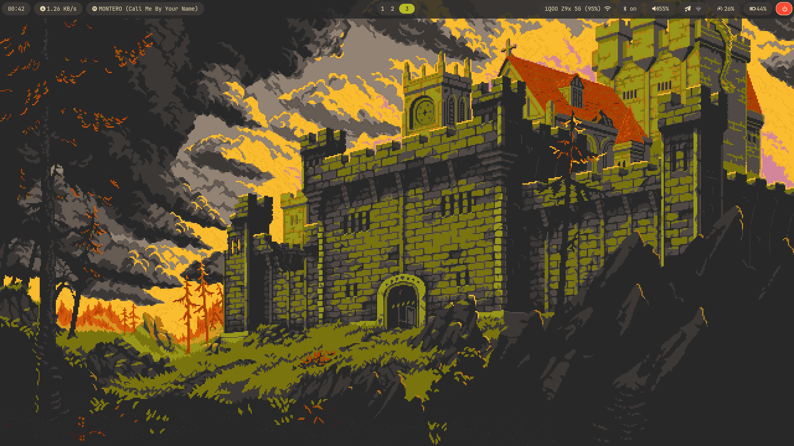

# Slice-of-Rice

<p align="center">
  A meticulously crafted, theme-switching Hyprland desktop environment built from the ground up on Arch Linux.
  <br><br>
</p>

<div align="center">


</div>

## ✨ Visual Showcase

A dynamic desktop experience with seamless, one-click theme switching between multiple curated palettes.

## Everforest
<p align="center">
  
  <em></em>
</p>

<p align="center">
  
  
  <em></em>
</p>

<br>

## Catppuccin
<p align="center">
  
  <em></em>
</p>

<p align="center">
  
  
  <em></em>
</p>

<br>

## Gruvbox
<p align="center">
  
  <em></em>
</p>

<p align="center">
  
  
  <em></em>
</p>


---

##  About This Rice

This repository contains the complete configuration for my personal desktop environment. The goal was to create a system that is not only beautiful and visually consistent but also highly functional and automated. The entire setup is built upon a minimal Arch Linux installation and is managed through this version-controlled `dotfiles` repository.

The core of this setup is a powerful, script-based **theming engine** that dynamically updates the entire desktop's appearance—from GTK applications and window borders to the terminal, lock screen, and even application-specific themes—all with a single click
<br><br>
### <p align="center">**THEME CHANGING SHORTCUT: SUPER + CTRL + T**</p>
<br>
<br>


## Key Features

<details>
  <summary><strong>  Visuals & Theming</strong></summary>
  
  - **Dynamic Theme Engine:** A custom-built script (`apply-theme.sh`) that reads from a central `themes.json` database to patch all application configs on the fly.
  - **Multiple Curated Themes:** Includes presets for Catppuccin, Everforest, and Gruvbox, each with light and dark variants.
  - **GTK Theming:** Primarily a `gtk theme` but soon `qt themes` will also be added.
  - **Animated & Static Wallpapers:** A unified wallpaper engine (`set-wallpaper.sh`) that intelligently handles static images (with `hyprpaper`), GIFs, and videos (with `mpvpaper`), with theme-persistent memory.
  - **Custom Lock Screen:** A highly customized `hyprlock` screen with dynamic widgets for album art, media controls, system info, and entrance animations.
</details>
<br>

<details>
  <summary><strong> Desktop Components</strong></summary>
  
  - **Compositor:** Hyprland, with custom animations, window rules, and keybindings.
  - **Status Bar:** A heavily customized Waybar with state-aware modules, custom script integration (media player, network speed), and a theme-switcher button.
  - **Application Launcher:** Wofi, with multiple, separately-themed instances for the app launcher, power menu, and clipboard history.
  - **Notification Daemon:** Dunst, themed with transparency and custom colors for different urgency levels.
  - **Terminal:** Kitty, with a custom, theme-aware configuration and instant-reloading of color schemes.
  - **Shell Prompt:** Zsh with Powerlevel10k, themed to match the active desktop palette.
</details>
<br>

<details>
  <summary><strong> Functionality & Scripts</strong></summary>

  - **Power Management:** An intelligent system using `hypridle` for locking, screen-off, and suspend, with a crash-proof resume configuration.
  - **On-Screen Displays (OSD):** Custom Dunst notifications with progress bars for volume and brightness changes.
  - **Screenshot & Recording:** A full suite of scripts for fullscreen, window, and regional screenshots and screen recording, using `grim`, `slurp`, and `wf-recorder`.
  - **Clipboard Manager:** A `cliphist` and Wofi-based clipboard history menu.
  - **Dotfile Management:** All configurations are cleanly organized and managed with `stow`.
</details>

##  Installation

These dotfiles are designed for an Arch Linux-based system running the Hyprland compositor.

1.  **Clone the Repository:**
    ```bash
    git clone https://github.com/Staggered95/slice-of-rice.git
    cd ~/dotfiles
    ```

2.  **Review and Run the Installer:**
    The `install.sh` script is the master key. It is recommended to review the script and the package lists (`pkglist.txt`, `pkglist_aur.txt`) before running.
    ```bash
    chmod +x install.sh
    sh install.sh
    ```

3.  **Reboot:**
    A reboot is required for all changes (shell, services, etc.) to take full effect.
    ```bash
    sudo reboot
    ```

##  Theming
The theme can be changed at any time with the shortcut keys `MOD+CTRL+T`. To add a new theme:
1.  Install the required GTK and Kvantum theme packages.
2.  Add a new entry with all the required metadata and color definitions to `~/.config/hypr/themes.json`.
3.  The theme will automatically appear in the Wofi selection menu.

---
<p align="center">
  Thank you for visiting!
</p>
